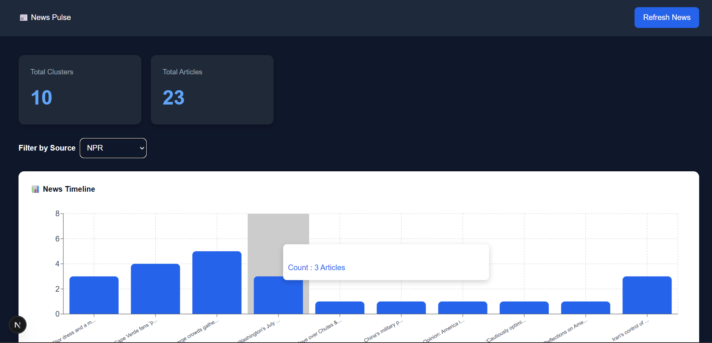
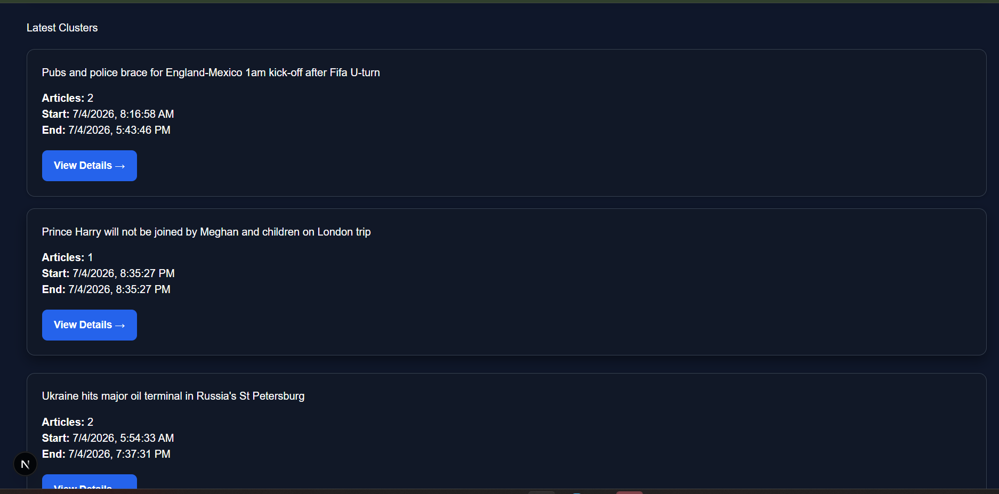
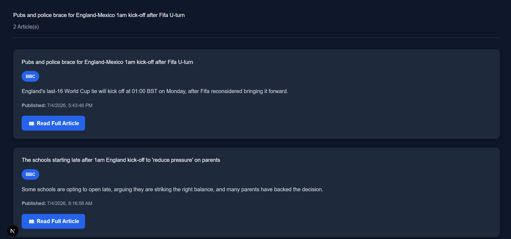
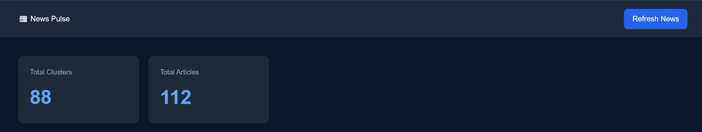

# 📰 News Pulse

News Pulse is a full-stack news aggregation and clustering platform that collects articles from multiple RSS feeds, extracts their content, groups similar news stories using Natural Language Processing (NLP), and presents them in an interactive dashboard.

The project automatically fetches the latest news from multiple trusted sources, stores them in MongoDB, clusters related articles using TF-IDF and Cosine Similarity, and visualizes the results with a modern Next.js frontend.

---

# Features

- Fetch news from multiple RSS feeds
- Automatic article extraction
- Store articles in MongoDB
- Cluster similar news articles
- Interactive dashboard
- Timeline visualization
- Source filtering
- Cluster detail page
- Read original article
- Refresh news with one click
- Responsive UI

---

# News Sources

- BBC
- NPR
- The New York Times
- The Guardian

---

# Tech Stack

## Frontend

- Next.js
- React
- TypeScript
- Axios
- Recharts

## Backend

- Node.js
- Express.js
- MongoDB
- Mongoose

## Scraper

- Python
- Feedparser
- Newspaper3k
- BeautifulSoup
- Scikit-learn

---

# NLP Techniques

The project groups related news using:

- Text Cleaning
- TF-IDF Vectorization
- Cosine Similarity
- Similarity Threshold Clustering

---

# Project Structure

```
News_Pulse/
│
├── backend/
│   ├── controllers/
│   ├── routes/
│   ├── models/
│   ├── config/
│   └── server.js
│
├── frontend/
│   ├── app/
│   ├── components/
│   └── public/
│
├── scraper/
│   ├── main.py
│   ├── rss_reader.py
│   ├── article_extractor.py
│   ├── cluster.py
│   └── database.py
│
├── screenshots/
│
└── README.md
```

---

# Installation

## Clone Repository

```bash
git clone https://github.com/codingwithomansaakib/News_Pulse.git

cd news-pulse
```

---

# Backend Setup

```bash
cd backend

npm install

npm run dev
```

---

# Frontend Setup

```bash
cd frontend

npm install

npm run dev
```

---

# Scraper Setup

```bash
cd scraper

pip install -r requirements.txt

python main.py
```

---

# Environment Variables

Backend `.env`

```
PORT=5000

MONGO_URI=mongodb://localhost:27017/news_pulse
```

---

# API Endpoints

## Get All Clusters

```
GET /clusters
```

Returns all clustered news.

---

## Get Cluster Details

```
GET /clusters/:id
```

Returns articles inside a cluster.

---

## Get Available Sources

```
GET /clusters/sources
```

Returns available news sources.

---

## Timeline

```
GET /timeline
```

Returns timeline data.

---

## Refresh News

```
POST /ingest/trigger
```

Runs the scraper and updates the database.

---

# Dashboard Features

✔ Dashboard Statistics

- Total Clusters
- Total Articles

✔ Timeline Chart

- Displays clustered news distribution

✔ Source Filter

- BBC
- NPR
- NYTimes
- The Guardian

✔ Cluster Cards

- Topic
- Number of Articles
- Start Time
- End Time
- View Details

✔ Cluster Details

- Article Title
- Source Badge
- Summary
- Published Date
- Read Full Article Button

---

# Screenshots

## Dashboard



---

## Source Filter



---

## Timeline


---

## Cluster Details



---

## Refresh News



---

# Workflow

```
RSS Feeds
     │
     ▼
Python Scraper
     │
     ▼
Article Extraction
     │
     ▼
MongoDB
     │
     ▼
TF-IDF Vectorization
     │
     ▼
Cosine Similarity
     │
     ▼
News Clustering
     │
     ▼
Express API
     │
     ▼
Next.js Dashboard
```

---


# Author

**Oman Saakib**

B.Tech Computer Science (AI & ML)

KR Mangalam University

GitHub: https://github.com/codingwithomansaakib

LinkedIn: https://www.linkedin.com/in/oman-saakib-7404b0255/

---

# License

This project is developed for educational purposes as part of a technical assessment.
